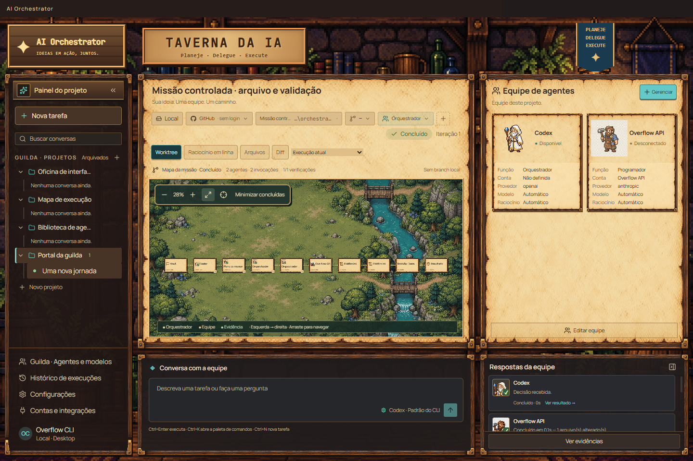
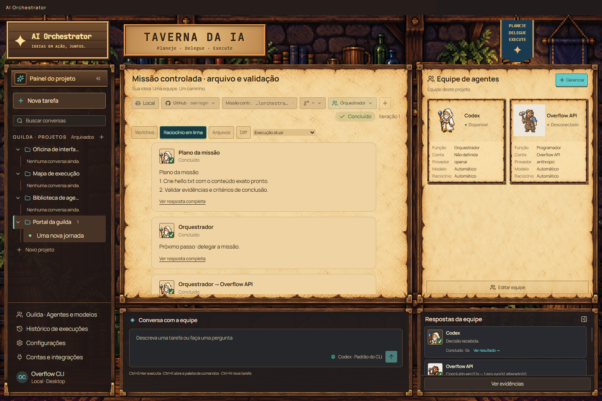

# Equipe, progresso e uma resposta final

Base: `main`, commit `b8cd80422c54809a2cf569f89926d31769cb97ea`, incluindo o
redesign RPG Pixel Art. A implementação conserva os assets, personagens,
animações, composição da taverna, mapa horizontal e controles existentes.

## Diagnóstico

O detector geral começava em zero e interrompia em `stagnantRounds >= 2`:
a primeira rodada definia a assinatura, a segunda incrementava para um,
e a terceira ainda executava antes da interrupção. Leituras acumuladas podiam
mudar a assinatura apenas por duplicação. `treeKey` comparava somente os
primeiros 4.000 caracteres do diff. Conversas, DAGs e algumas recusas usavam
`continue` antes desse detector.

Os resumos de todas as decisões viravam mensagens, inclusive propostas `done`
antes do DoneGate. Depois, outros pontos publicavam conclusão/custo/estado.
O mapa reconstruía invocações e steps, a timeline reconstruía mensagens e o
Activity misturava participações com progresso volátil. Isso permitia eco,
conclusões prematuras e apresentações diferentes do mesmo trabalho.

## Fonte de verdade

Migração SQLite 22: `execution_events`, com ID idempotente, sequência monotônica,
run, tipo, instante, pai, iteração, agente, invocation, papel, estado, resumo e
dados estruturados. Um índice único parcial impede duas `FINAL_RESPONSE` na
mesma run. `ExecutionEvent` vive no domínio, sem dependências de Electron.

O armazenamento é alimentado pelos limites reais da execução:

- Criação da run registra o objetivo.
- A primeira decisão registra o plano; decisões seguintes registram o próximo
  passo e seus critérios.
- `beforeInvocation`, dentro da política de execução, registra seleção,
  delegação e início. Uma chamada recusada pela política não cria participação.
- O retorno registra `AGENT_RESULT`; o relatório anexa evidências, alterações,
  riscos, recomendação e saída completa, sem outra chamada de modelo.
- Mudança da ferramenta em execução atualiza um único `AGENT_PROGRESS` por
  invocation. Heartbeats não criam respostas nem linhas repetidas.
- Verificações, leituras, evidências e DoneGate registram fatos e critérios.
- A transação que termina a run fecha atividade pendente e grava a resposta
  final. Diagnósticos tardios atualizam a consolidação, mantendo um único final.

Steps, invocations e mensagens continuam disponíveis como diagnóstico e para
compatibilidade. Não são um segundo motor nem a fonte visual das runs novas.
Não se registra o raciocínio privado ou streaming de tokens como trace público.
Valores são redigidos antes da codificação JSON, preservando JSON válido.

## Planejamento e equipe

O contrato de decisão v10 inclui `mission`: resultado esperado, critérios,
evidências esperadas, arquivos relevantes, restrições e exclusões. O campo é
compatível com decisões antigas; quando fornecido, critérios vazios são
recusados. Cada tarefa de `delegations` pode ter sua própria missão. Só os
arquivos relevantes já lidos entram no pacote quando a missão os delimita.

O DAG existente continua executando dependências e joins reais. Escritas locais
continuam serializadas; os limites de conta/runtime continuam controlando o
paralelismo. Resultados de dependências são entregues ao próximo trabalhador.
O supervisor recebe resultados e escolhe implementar, revisar, testar, corrigir,
concluir ou pedir intervenção. Uma tarefa pequena pode terminar após uma única
delegação e a verificação independente do aplicativo.

## Anti-loop

Há duas proteções complementares: admissão antes da delegação e comparação de
evidência depois da rodada. A admissão considera missão, agente, estado real da
árvore, conteúdo lido, critérios, retornos e verificações. Repetições de leituras
e resultados não acrescentam fatos; timestamps e IDs não simulam progresso.
Hashes preservam diferenças reais de bytes. O diff inteiro participa do hash.

Duas rodadas equivalentes bastam para interromper antes de uma terceira chamada
redundante. DAGs repetidos passam por uma proteção própria e pela admissão
comum. O próximo estado é `NEEDS_HUMAN`, com a necessidade de mudar estratégia
ou fornecer evidência. O limite de iterações permanece como último recurso.
Recusas mecânicas continuam seguindo as políticas existentes, sem promoção
automática para um modelo mais caro.

## Conclusão e retomada

`DONE`, `PARTIAL`, `NEEDS_HUMAN`, `BLOCKED`, `FAILED` e `CANCELLED` têm um único
final do Orquestrador, curto, com detalhes acessíveis. `DONE` continua dependendo
do DoneGate. Ao esgotar iterações, alterações medidas resultam em `PARTIAL`,
com os critérios pendentes; ausência de entrega resulta em `FAILED`.

Na retomada autorizada de `NEEDS_HUMAN`, o final anterior passa a representar
a pausa humana no histórico. A próxima terminalização produz o único final
vigente. Cancelamento vence respostas tardias e não abre novas invocações.

## Duas visualizações e Activity

`executionTrace(detail)` é a projeção comum:

```
execution_events → RunDetailView.executionEvents → executionTrace
                                                 ├─ Working Tree
                                                 ├─ Raciocínio em linha
                                                 └─ Activity
```

O mapa apresenta relações e dependências; o diário apresenta a sequência
persistida, agrupando início/progresso/resultado da mesma chamada. O resultado
ocupa o ponto em que retornou, inclusive em execução paralela. Activity usa
as mesmas participações e o mesmo final. Os IDs de origem ficam disponíveis
no DOM para a prova de correspondência. O renderer não grava histórico próprio.

Runs anteriores são importadas uma vez a partir de fatos persistidos, marcados
como legados. Não se inventa um plano ou agente ausente do registro antigo.

## Verificação reproduzível

```sh
npm run typecheck
npm test
npm run desktop:test
npm run -w apps/desktop package
npm run -w apps/desktop test:packaged
node apps/desktop/scripts/rpg-visual.mjs --output=out/rpg
node apps/desktop/scripts/rpg-visual.mjs --mission --output=out/controlled
```

`--mission` executa a orquestração real com adaptadores determinísticos de teste,
um subprocesso real que escreve `hello.txt`, verificação independente dos bytes
e persistência SQLite. Asserta uma chamada de trabalhador, um final e IDs do
diário pertencentes ao mesmo log. Não usa credenciais nem simula uma chamada
paga a um provedor. `controlled-run.json` registra explicitamente essa distinção.
`--binary=...` repete a prova dentro do aplicativo empacotado.

O CI Windows e Linux executa essa missão no binário empacotado. O job Windows
mantém a publicação existente do instalador NSIS com tag vinculada ao commit.
Os testes novos cobrem os seis estados terminais, reabertura do banco, pausa e
retomada, ausência da terceira chamada, eco, critérios da missão, redação JSON,
importação histórica e equivalência das projeções. As suítes existentes continuam
cobrindo contas, tetos, políticas, permissões, GitHub privado e cancelamento.

## Evidência local (Windows, 10/09/2026)

- Typecheck: aprovado.
- Suíte root: 1.068 aprovados, 3 skips condicionais de plataforma, zero falhas
  (1.071 testes; Node com `--test-concurrency=4`).
- Electron real: 46/46 aprovados, incluindo erro de prontidão e abertura do
  registro completo pelo diário.
- Smoke do aplicativo empacotado: 11/11, repetidos após reinício do processo.
- Missão controlada empacotada: uma chamada de worker, arquivo validado,
  exatamente um final e os mesmos IDs no mapa e no diário.
- A mesma revisão do DoneGate aparece uma vez; o primeiro próximo passo tem o
  plano como pai. O final reúne os resultados de rodadas anteriores.
- Nenhum asset ou personagem RPG foi substituído. O CSS existente foi mantido;
  as regras do diário foram adicionadas usando o tema incorporado na `main`.

As capturas abaixo são da mesma missão controlada no aplicativo Windows
empacotado, depois de reabrir seu banco isolado. O teste compara os IDs de
origem de todos os nós com os do diário e exige igualdade exata.






