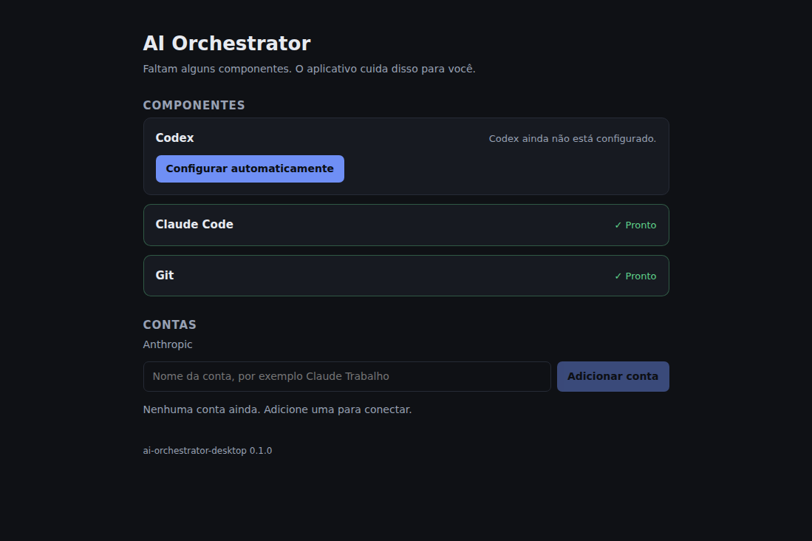
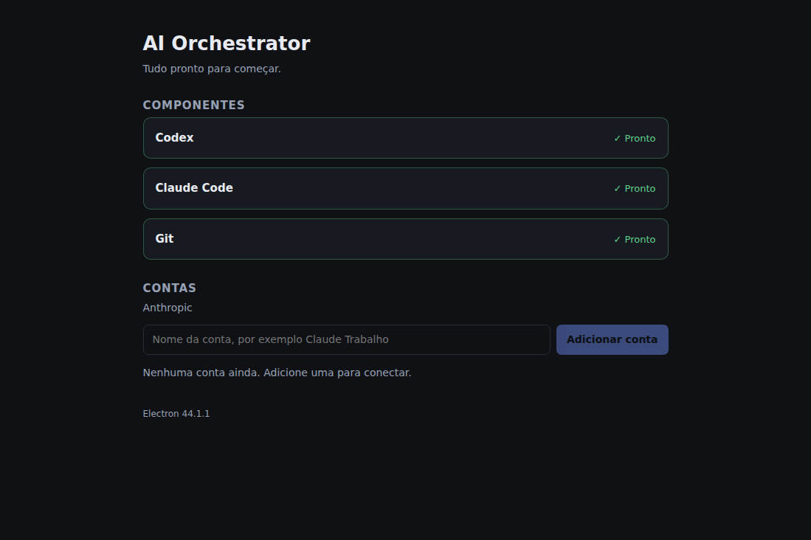

# Session handoff — fundação Electron

Este documento existe para que uma **nova sessão** continue o projeto sem depender
da conversa anterior. Ele descreve o estado real do repositório, o que já está
pronto, o que não pode ser renegociado e exatamente o que fazer a seguir.

Escrito em 2026-09-03; revisado no fim da fase **fundação Electron**, contra o
código que está no repositório.

---

## 1. Estado atual

> Atualizado ao fim da fase **fundação Electron**. O conteúdo anterior descrevia
> o estado antes dessa fase e foi substituído; o histórico está no git.

| | |
|---|---|
| Repositório | `Arcanjog1/Orquestrador` |
| Branch | `claude/ai-orchestrator-continuation-sbzrfg` |
| Working tree | **Limpo** |
| Testes | **188 passando, 0 falhando, 0 pulados** |
| Typecheck (núcleo) | `tsc -p tsconfig.test.json --noEmit` → limpo |
| Typecheck (desktop) | `tsc -p apps/desktop/tsconfig.json --noEmit` → limpo |
| Electron | **44.1.1** (fixado, sem `^`) |
| Node embutido | **24.19.0** |
| Chromium embutido | **152.0.7977.65** |
| SQLite embutido | **3.53.3** |
| Node usado no desenvolvimento | v22.22.2 / npm 10.9.7 |
| Dependências de runtime | **nenhuma**, nem no núcleo nem no desktop |

**Ambiente de desenvolvimento:** container Linux. Não há Windows. O `claude` CLI
existe (v2.1.252) e o `git` também. A rede é restrita: `registry.npmjs.org` é
alcançável (o que permitiu instalar o Codex de verdade pela interface),
`releases.openai.com` e os hosts da Anthropic não são.

---

## 2. O que já está implementado

Tudo abaixo está commitado, com testes.

### RuntimeManager (`src/runtime/`)
Fachada que responde “está tudo pronto e, se não, eu consigo resolver sozinho?”.
`diagnose()` devolve o checklist completo que a tela de primeira execução
renderiza. `prepareAll()` acumula falhas em vez de parar na primeira.

### ManagedRuntime — pipeline de instalação
`resolve → download → verificar integridade → extrair → health check em staging
→ capability check → promover → health check`. Só um build que já se provou em
staging substitui o que funciona. Layout `current/` + `previous/`.

### CodexRuntime
Origens em ordem: canal oficial de release → tarball do registry npm
(`PACKAGE_INTERNAL`). O build Windows é nativo — **não precisa de Node**.
Layout real do pacote: `package/vendor/x86_64-pc-windows-msvc/bin/codex.exe`,
com `codex-resources/` e `codex-path/` ao lado (por isso a árvore inteira é
promovida, nunca só o `bin/`).

### ClaudeCodeRuntime
Origens: instalador oficial documentado → host de release observado dentro do
binário, marcado `NOT_PUBLIC_CONTRACT` e **sempre em último**. Binário nativo,
também dispensa Node. **Nunca redistribuído** dentro do nosso instalador (licença
npm: `SEE LICENSE IN README.md`, não permissiva).

### GitRuntime / MinGit
`MinGitReleaseSource` lê o feed de releases do Git for Windows e escolhe
`MinGit-<v>-64-bit.zip` — não o instalador completo, não o busybox (fallback).
Recusa fora do Windows. Arquivos `LICENSE`/`COPYING`/`NOTICE` são localizados e
gravados no manifesto (GPL-2.0). Ver `THIRD-PARTY-NOTICES.md`.

### AccountManager (`src/accounts/`)
Contas Claude isoladas. O usuário digita “Claude Trabalho”; o app cria e gerencia
o diretório. Três garantias testadas:
- variáveis de credencial do ambiente são **deletadas** do processo filho;
- conta logada sem `.credentials.json` próprio vira `ambient-credential`,
  **nunca** `connected`;
- remoção recusa qualquer caminho fora da pasta de perfis.

Login dirigido por GUI: stdio em pipe, captura a URL, entrega para o app abrir o
navegador, detecta conclusão por polling de `auth status --json`.

### RuntimeSource — contrato e confiança
Cada origem declara `contract` (`DOCUMENTED` / `PACKAGE_INTERNAL` /
`NOT_PUBLIC_CONTRACT`) e `integrityStrategy`. `orderedSources()` ordena por
contrato e depois por confiança; uma origem `NOT_PUBLIC_CONTRACT` **nunca** fica
à frente de uma documentada, seja qual for a ordem declarada.

### Política de compatibilidade (`compatibility.ts`, `version.ts`)
Distingue **AVAILABLE / TESTED / INSTALLED / COMPATIBLE**. Primeira instalação
pede a versão testada, nunca `latest`. Nenhum runtime pode usar política
`latest` (há teste impedindo).

Versões testadas hoje: codex `0.153.0` (min `0.150.0`), claude-code `2.1.252`
(min `2.0.0`), git `2.47.0` (min `2.30.0`).

> **Detalhe que virou código:** `0.153.0-win32-x64` em semver estrito é
> *prerelease* e ordenaria **antes** de `0.153.0`. O parser reconhece e remove o
> sufixo de plataforma.

### Integridade / trust (`integrity.ts`)
`checksum = null` significa `UNVERIFIED_BINARY_SOURCE`, não “pode instalar”.
Estratégias: `NPM_INTEGRITY`, `SHA256`, `SIGNED_MANIFEST`, `AUTHENTICODE`,
`HTTPS_ONLY_LAST_RESORT`. Authenticode é lido via PowerShell; o publisher é
**observado e registrado**, nunca um nome inventado — só há recusa se uma
expectativa tiver sido explicitamente configurada.

### Rollback current/previous
Falha no capability check → o install em uso não é tocado. Falha no health check
depois de promovido → reverte sozinho. `rollBack()` restaura sob demanda.

### SqlDriver / node:sqlite / schema (`src/database/`)
`SqlDriver` é a costura: repositórios, orchestrator-core, agents, workspaces e UI
não veem SQL nem binding. `node:sqlite` é embutido no Node que o Electron traz —
**sem módulo nativo, sem `electron-rebuild`, sem prebuild por arquitetura**.
Provado dentro do Main real e dentro do aplicativo **empacotado** (seção 6a).

> **Detalhe que virou código:** o módulo era carregado com
> `createRequire(import.meta.url)`. Isso funciona no Node puro e quebra assim que
> o Main é empacotado em CommonJS, porque o bundler troca `import.meta` por um
> objeto vazio. O sintoma era “node:sqlite não existe no Electron”, o que era
> falso. Hoje o carregamento passa por `process.getBuiltinModule`, idêntico em
> ESM, em CommonJS e dentro do asar. Ver `loadNodeSqlite()` em `driver.ts`.

15 tabelas, migrations ordenadas e idempotentes. Só metadados nas tabelas; diffs
e stdout ficam em disco com linha apontando. Repositórios existentes:
`runtimeInstallations`, `accounts`, `settings`.

### Aplicativo desktop (`apps/desktop/`)
Electron **44.1.1** fixado. Main + preload empacotados com esbuild em dois
arquivos `.cjs`; renderer React com Vite. O desktop não tem lógica de
orquestração: a tela de primeira execução renderiza o que
`RuntimeManager.diagnose()` devolve.

- **IPC tipado** (`shared/ipc-contract.ts`): uma tabela de operações nomeadas.
  Não existe `exec`, `shell` nem `runCommand`, e há teste garantindo que não
  passe a existir.
- **Validação em runtime** (`shared/validation.ts`): todo payload é reconferido
  no Main. Ids de conta seguem um conjunto fechado de caracteres, porque nomeiam
  um diretório em `profiles/`.
- **Roteador** (`main/ipc/router.ts`): sem Electron, portanto testável. Nada
  lançado por um serviço atravessa a ponte: vira `IpcFailure` com frase para o
  usuário e código estável.
- **Serviços** (`main/services/`): traduzem fases de instalação em passos
  amigáveis, guardam os handles de cancelamento, derivam ids de conta e mantêm
  a URL de login fora de tudo que o renderer recebe.
- **Duas provas embutidas no próprio aplicativo**, para que o executável
  empacotado seja verificado pelo mesmo código do build de desenvolvimento:
  `--self-test` (banco) e `--smoke-test` (ponte, isolamento, onboarding).
  `--smoke-test` aceita, por variável de ambiente,
  `ORCHESTRATOR_SMOKE_INSTALL=<runtimeId>` e `ORCHESTRATOR_SMOKE_LOGIN=1` para
  exercitar de verdade a instalação e o login, e
  `ORCHESTRATOR_SMOKE_SCREENSHOT=<caminho>` para gravar a tela.

### Testes relevantes
```
ipc-contract.test.ts      canais x handlers, nomes, fases traduzidas, opções da janela
ipc-validation.test.ts    todo payload hostil que a ponte poderia receber
ipc-router.test.ts        despacho, recusa, e nenhuma exceção atravessando
desktop-services.test.ts  progresso, cancelamento, contas, URL de login contida
runtime-cancel.test.ts    AbortSignal no pipeline, sem promoção pela metade
runtime-install.test.ts   instalação atômica, download corrompido, fallback entre origens
runtime-policy.test.ts    versões, compatibilidade, integridade, ordenação, rollback, licenças
runtime-manager.test.ts   diagnose, prepareAll, MinGit, mensagens sem "PATH"
claude-accounts.test.ts   isolamento, env limpo, credencial ambiente, traversal
database.test.ts          migrations, FKs, transações, provenance, rollback registrado
process-manager.test.ts   argv Windows, .cmd, timeout, cancelamento, órfãos
done-gate.test.ts         DONE nunca aceito sem evidência
git-safety.test.ts        comandos destrutivos recusados
```

---

## 3. Decisões arquiteturais inegociáveis

Não renegociar nenhuma destas sem instrução explícita do usuário.

1. **Aplicativo desktop Windows.** O entregável é `AI-Orchestrator-Setup.exe`.
2. **O usuário final não usa PowerShell.** Nem CMD. Se algum fluxo normal exigir
   terminal, o requisito não foi atendido.
3. **O usuário final não instala Node nem npm.** Os dois agentes são binários
   nativos; o Electron traz o próprio Node. O app não precisa de Node externo.
4. **Runtimes gerenciados pelo app**, em `%LOCALAPPDATA%\AI-Orchestrator\`.
   Instalação por usuário, **sem UAC**.
5. **Adapters nunca dependem do PATH como fluxo principal.** Sempre
   `RuntimeManager.getExecutablePath()` → caminho absoluto. Nunca
   `spawn("codex")`, `spawn("claude")`, `spawn("git")`.
6. **Múltiplas contas Claude isoladas** por `CLAUDE_CONFIG_DIR`, que o app
   gerencia e o usuário nunca vê.
7. **Renderer sem acesso direto a Node, CLI ou SQLite.** `contextIsolation=true`,
   `nodeIntegration=false`.
8. **Main Process controla runtimes, processos e banco.** Toda operação
   privilegiada passa por IPC tipado.
9. **GitHub não é intermediador de mensagens.** O AI Orchestrator local é o
   intermediador.
10. **Nenhum comando arbitrário de LLM é executado como verificação.** O
    orquestrador pede uma verificação **por id**, resolvida contra
    `verification_definitions`, que o dono do workspace cadastrou.
11. **DONE exige validação independente.** O agente dizer “pronto” não encerra
    nada. Ver `src/orchestrator/done-gate.ts`.
12. **Nunca redistribuir o Claude Code** dentro do instalador sem autorização
    expressa da Anthropic.
13. **Segurança git preservada:** sem `reset --hard`, `clean -fd`,
    `push --force`, `checkout -- .`, `restore .`, `branch -D`. Sem commit, push
    ou merge automático.

---

## 4. Estrutura atual do repositório

```
src/                    NÚCLEO. Sem dependências, sem Electron.
  runtime/            RuntimeManager e tudo que instala runtimes
    types.ts            RuntimeId, RuntimeSource, RuntimeManifest, erros,
                        RuntimeOperationOptions, RuntimeCancelledError
    paths.ts            layout de %LOCALAPPDATA%\AI-Orchestrator\
    managed-runtime.ts  pipeline de instalação, rollback, detecção, cancelamento
    runtime-manager.ts  fachada + diagnose() + prepareAll()
    runtimes.ts         CodexRuntime, ClaudeCodeRuntime, GitRuntime
    compatibility.ts    política de versões (RUNTIME_COMPATIBILITY)
    version.ts          comparação de versões
    integrity.ts        estratégias, trust level, Authenticode
    downloader.ts       download com progresso, verificação e AbortSignal
    archive.ts          extração (tar do SO), busca de executável
    sources/            codex-sources, claude-sources, git-sources, npm-registry
  accounts/           account-types, claude-account-manager
  database/           driver (+ loadNodeSqlite), node-sqlite-driver, schema,
                      database (runtimeInstallations, accounts, settings)
  process/            process-manager      (crítico para Windows)
  git/                git-safety, git-evidence-collector
  orchestrator/       decision-parser, done-gate, verifier, acceptance-criteria
  sessions/           session-manager, state-manager, final-report
  security/           secret-redactor
  logger/  core/  preflight/  agents/

apps/desktop/           APLICATIVO. A única parte que conhece Electron.
  src/shared/           contrato de IPC e validação (main + preload + renderer)
  src/main/             SEM Electron: serviços, roteador, bootstrap, self-test
    app-services.ts       monta Database, RuntimeManager, ProcessManager, contas
    ipc/router.ts         tabela de operações + dispatch
    services/             runtime-service, account-service
    self-test.ts          prova de node:sqlite via o Database real
  src/electron/         COM Electron: main.ts, preload.ts, smoke-test.ts
  src/renderer/         React mínimo: onboarding, cards de runtime, contas
  scripts/              build-main.mjs (esbuild), dev.mjs
  electron-builder.yml  NSIS por usuário, sem UAC
  vite.config.mts  tsconfig.json  index.html

tests/                  19 arquivos, 188 testes
  helpers/              git-fixture, fake-runtime-source
spike/                  windows-spike.mjs   (ferramenta INTERNA de desenvolvimento)
docs/                   este arquivo + images/
.github/workflows/      desktop.yml (testes + instalador Windows em runner real)
SPIKE.md  THIRD-PARTY-NOTICES.md
tsconfig.json  tsconfig.base.json  tsconfig.test.json  package.json
```

O repositório é um workspace npm: `npm install` na raiz cobre núcleo e desktop.

---

## 5. Contratos importantes

Assinaturas, não implementações. Ler o arquivo quando precisar do corpo.

```ts
// src/runtime/types.ts
type RuntimeId = 'codex' | 'claude-code' | 'git';
type ContractLevel = 'DOCUMENTED' | 'PACKAGE_INTERNAL' | 'NOT_PUBLIC_CONTRACT';
type RuntimeOrigin = 'managed' | 'system' | 'missing';

interface RuntimeSource {
  readonly id: string;
  readonly label: string;
  readonly contract: ContractLevel;
  readonly integrityStrategy: IntegrityStrategy;
  readonly expectedPublisher?: string;
  resolve(target: RuntimeTarget, request: VersionRequest): Promise<ResolvedDownload | null>;
}

interface RuntimeManifest {
  runtimeId; version; sourceId; sourceLabel; contract;
  url; host; platform; arch; bytes; sha256;
  integrity: IntegrityVerdict; trustLevel: TrustLevel;
  executableRelativePath: string;   // relativo a current/
  installedAt: string;
  previousVersion?: string;
  licenseFiles?: string[];
}

class RuntimeNotReadyError extends RuntimeError {
  userMessage: string;   // "Codex ainda não está configurado."
  remedy: string;        // "Configurar automaticamente"
}

/**
 * Cancelamento. Honrado apenas ATÉ a promoção: depois dela o pipeline termina,
 * faz health check e reverte sozinho, porque meio runtime promovido é pior do
 * que uma instalação a mais.
 */
interface RuntimeOperationOptions { signal?: AbortSignal }
class RuntimeCancelledError extends RuntimeError {}
```

```ts
// src/runtime/managed-runtime.ts
abstract class ManagedRuntime {
  abstract readonly id: RuntimeId;
  abstract readonly displayName: string;
  abstract readonly sources: readonly RuntimeSource[];

  get installDir(): string;      // runtimes/<id>
  get currentDir(): string;      // runtimes/<id>/current
  get previousDir(): string;     // runtimes/<id>/previous
  get canRollBack(): boolean;
  get compatibility(): RuntimeCompatibility;

  detect(): Promise<RuntimeDetection>;
  getExecutablePath(): Promise<string>;          // lança RuntimeNotReadyError
  healthCheck(): Promise<HealthStatus>;
  capabilityCheck(exe: string): Promise<{ ok: boolean; detail: string }>;
  install(onProgress?: ProgressReporter, options?: RuntimeOperationOptions): Promise<InstallResult>;
  update(onProgress?: ProgressReporter, options?: RuntimeOperationOptions): Promise<InstallResult | null>;
  repair(onProgress?: ProgressReporter, options?: RuntimeOperationOptions): Promise<InstallResult>;
  rollBack(): Promise<InstallResult | null>;
  findAvailableVersion(): Promise<{ version: string; sourceId: string } | null>;
  orderedSources(): RuntimeSource[];
}
```

```ts
// src/runtime/runtime-manager.ts
interface RuntimeStatus {
  runtimeId; displayName;
  detection: RuntimeDetection;
  health: HealthStatus;
  canAutoConfigure: boolean;
}
interface DiagnosticReport {
  ready: boolean;
  runtimes: RuntimeStatus[];
  pending: RuntimeId[];
  checkedAt: string;
}

class RuntimeManager {
  constructor(options?: ManagedRuntimeOptions);
  readonly paths: AppPaths;
  get(runtimeId): ManagedRuntime;
  list(): ManagedRuntime[];
  getExecutablePath(runtimeId): Promise<string>;
  detect(runtimeId): Promise<RuntimeDetection>;
  healthCheck(runtimeId): Promise<HealthStatus>;
  diagnose(): Promise<DiagnosticReport>;              // ← a tela de onboarding
  install(runtimeId, onProgress?, options?: RuntimeOperationOptions): Promise<InstallResult>;
  repair(runtimeId, onProgress?, options?: RuntimeOperationOptions): Promise<InstallResult>;
  update(runtimeId, onProgress?, options?: RuntimeOperationOptions): Promise<InstallResult | null>;
  prepareAll(onProgress?): Promise<{ ready; installed; failures }>;
}

interface InstallProgress {
  runtimeId; phase: InstallPhase; message: string; percent?: number;
}
type InstallPhase = 'resolving' | 'downloading' | 'verifying' | 'extracting'
  | 'staging-health-check' | 'installing' | 'health-check' | 'rolled-back' | 'done';
```

```ts
// src/accounts/claude-account-manager.ts
type AuthState = 'connected' | 'disconnected' | 'ambient-credential' | 'runtime-missing';

class ClaudeAccountManager {
  constructor(options: { runtimeManager; paths?; processManager? });
  profileDirectory(accountId): string;               // sempre absoluto
  createAccount(account: Account): Account;
  removeAccount(accountId): void;
  listProfileDirectories(): string[];
  buildEnvironment(accountId): Record<string, string | undefined>;
  hasOwnCredentials(accountId): boolean;             // só existência
  getStatus(account): Promise<AccountStatus>;
  verifyProfileInUse(account): Promise<boolean>;
  connect(account, options?: {
    onProgress?: (p: LoginProgress) => void;
    openUrl?: (url: string) => void | Promise<void>; // o app abre o navegador
    signal?: AbortSignal;
  }): Promise<AccountStatus>;
}
```

```ts
// apps/desktop/src/shared/ipc-contract.ts
export const BRIDGE_KEY = 'orchestrator';         // window.orchestrator

type InvokeChannel =
  | 'app:getInfo' | 'app:getBootstrapState'
  | 'runtime:diagnose' | 'runtime:install' | 'runtime:repair'
  | 'runtime:cancelInstall'
  | 'accounts:list' | 'accounts:create' | 'accounts:remove'
  | 'accounts:status' | 'accounts:connect' | 'accounts:cancelConnect';

type EventChannel = 'runtime:progress' | 'accounts:loginProgress';

type IpcResult<T> =
  | { ok: true; data: T }
  | { ok: false; userMessage: string; remedy?: string;
      code: 'INVALID_REQUEST' | 'RUNTIME_ERROR' | 'ACCOUNT_ERROR'
          | 'DATABASE_ERROR' | 'INTERNAL' };

interface InstallProgressEvent {          // InstallProgress, já traduzido
  runtimeId; step: 'Baixando' | 'Verificando' | 'Instalando' | 'Testando'
                 | 'Concluído' | 'Restaurado';
  message: string; percent?: number;
  diagnostic?: InstallProgress;           // só em developer mode
}

interface LoginProgressEvent {            // LoginProgress SEM a url
  accountId; phase: LoginPhase; message: string; browserOpened: boolean;
}
```

```ts
// apps/desktop/src/main/ipc/router.ts     — sem Electron, portanto testável
const HANDLERS: Record<InvokeChannel, Handler>;
function missingHandlers(): InvokeChannel[];
function dispatch<T>(services, channel: string, payload: unknown): Promise<IpcResult<T>>;
```

```ts
// apps/desktop/src/main/app-services.ts
class AppServices {
  constructor(options: {
    appName; appVersion;
    emit; emitLogin;                       // Electron injeta webContents.send
    openExternal;                          // Electron injeta shell.openExternal
    log?; paths?; developerMode?;
  });
  readonly database: Database;
  readonly runtimeManager: RuntimeManager;
  readonly processManager: ProcessManager;
  readonly claudeAccounts: ClaudeAccountManager;
  readonly runtime: RuntimeService;
  readonly accounts: AccountService;
  appInfo(): AppInfo;
  bootstrapState(): BootstrapState;
  dispose(): Promise<void>;
}
```

```ts
// src/database/driver.ts
interface SqlDriver {
  exec(sql: string): void;
  run(sql, params?): { changes: number; lastInsertRowid: number | bigint };
  all<T>(sql, params?): T[];
  get<T>(sql, params?): T | undefined;
  transaction<T>(fn: () => T): T;
  close(): void;
}
function nodeSqliteAvailable(): boolean;

// src/database/database.ts
class Database {
  constructor(options?: { paths?; driver?; filePath? });
  readonly driver: SqlDriver;
  get schemaVersion(): number;
  transaction<T>(fn: () => T): T;
  readonly runtimeInstallations: RuntimeInstallationRepository;
  readonly settings: SettingsRepository;
  close(): void;
}
```

Entidades do banco (15): `providers`, `accounts`, `agents`, `workspaces`,
`workspace_agents`, `chat_sessions`, `messages`, `runs`, `run_steps`,
`agent_invocations`, `artifacts`, `verification_definitions`,
`verification_results`, `runtime_installations`, `settings`.

```ts
// src/process/process-manager.ts   — não reescrever, já resolve o Windows
class ProcessManager {
  run(options: {
    command; args?; cwd; env?; stdin?;      // prompt SEMPRE por stdin
    timeoutMs?; graceMs?; maxOutputBytes?;
    signal?; onStdout?; onStderr?; stdio?: 'pipe' | 'inherit';
  }): Promise<ProcessResult>;
  cancelAll(graceMs?): Promise<void>;
  get liveCount(): number;
}
function buildSpawnPlan(command, args, platform?, comSpec?): SpawnPlan;
```
Regras: `shell: false` sempre; `.cmd`/`.bat` embrulhados em `cmd.exe /d /s /c`;
árvore morta com `taskkill /T /F` no Windows e process group no POSIX.

```ts
// src/orchestrator/
function parseDecision(raw: string): ParseResult;    // JSON validado + reparo de formato
function evaluateDone(input: DoneGateInput): Promise<DoneGateResult>;
function formatDoneRejection(result): string;        // "DONE_REJECTED\n..."
class Verifier { runAll(commands): Promise<CommandResult[]>; }
class AcceptanceCriteriaLedger { add/mark/pending/satisfied }
```

---

## 6. O que ficou provado nesta fase

Executado de verdade, não deduzido.

### 6a. `node:sqlite` — resolvido
`--self-test` dirige o **`Database` real** do produto: `node:sqlite` disponível,
abrir, migrations até o schema esperado, WAL, prepared statement, INSERT, SELECT,
transação com commit e com rollback, fechar, reabrir e ler.

| | |
|---|---|
| Electron Main (não empacotado) | ✅ passou |
| Electron Main **empacotado (asar)** | ✅ passou, `packaged: true` |

Nenhuma dependência SQLite nativa foi introduzida. `SqlDriver` não mudou.

### 6b. Ponte, isolamento e onboarding
`--smoke-test`, dentro do aplicativo **empacotado**: preload expõe
`window.orchestrator`; `require`, `process` e `module` são `undefined` na página;
nenhum canal genérico; `app.getInfo`, `app.getBootstrapState`,
`runtime.diagnose` e `accounts.list` respondem; um `runtimeId` inválido e um
`accountId` com traversal são recusados com `INVALID_REQUEST`; o onboarding
renderiza o diagnóstico; nenhum termo de terminal aparece na tela.

### 6c. Instalação de runtime pela interface — provada de ponta a ponta
Com `ORCHESTRATOR_SMOKE_INSTALL=codex`, num container Linux com acesso ao
registry npm: Renderer → IPC → `RuntimeManager.install()` → download real →
verificação de integridade → extração → health check em staging → promoção →
health check → eventos de progresso de volta no Renderer.

Passos que o Renderer recebeu: `Baixando > Verificando > Instalando > Testando >
Concluído`. Nenhuma mensagem trouxe PATH, spawn, stderr, tarball ou exit code.
`diagnose()` seguinte já reportava `codex` saudável.

### 6d. Login Claude pela interface — iniciado de verdade, não concluído
Com `ORCHESTRATOR_SMOKE_LOGIN=1`: conta criada pela interface, `connect`
iniciado, CLI dirigido pelo Main, URL capturada, navegador aberto pelo Main,
fases `starting > awaiting-browser > waiting-for-completion` recebidas no
Renderer, cancelamento reconhecido, conta removida pela interface. **A URL nunca
apareceu em nada que o Renderer recebeu.**

Não foi possível concluir o login: exige uma pessoa e um navegador. O estado
devolvido foi `ambient-credential`, que é exatamente o comportamento projetado —
o container tem credencial de ambiente e o app **recusa** chamar isso de
`connected`.

### 6e. Empacotamento
| | |
|---|---|
| Payload Linux (`electron-builder --dir`) | ✅ `release/linux-unpacked/`, `app.asar` 326 KB |
| Payload Windows (`--win nsis`) | ✅ `release/win-unpacked/AI Orchestrator.exe` + `app.asar` |
| Instalador `AI-Orchestrator-Setup.exe` | ❌ **não gerado aqui** — ver 7.1 |

`app.asar` tem 326 KB porque não há uma única dependência de produção: o React
é embutido pelo Vite e o Main pelo esbuild.

---

## 7. Limitações e blockers abertos

Numerados por prioridade de release.

1. **O instalador Windows não foi gerado neste ambiente.** `electron-builder`
   monta o payload Windows inteiro e falha só no último passo, que executa o
   stub NSIS sob wine de 32 bits. O `wine` de 64 bits instalou; o de 32 bits
   não, porque a política de egress do container bloqueia a origem das
   dependências i386. **Não é um defeito do projeto**: é um ambiente Linux sem
   wine completo. Fechado por `.github/workflows/desktop.yml`, que constrói o
   instalador num runner **Windows real** e roda `--self-test` e `--smoke-test`
   contra o executável empacotado. **Esse workflow ainda não rodou.**
2. **SmartScreen.** Sem certificado de code signing, o Windows exibirá “O Windows
   protegeu o seu PC”. Decisão consciente; a pipeline nasce pronta para assinar.
3. **Origens reais no Windows — parcialmente verificadas.** O resolver do npm
   registry foi exercitado de verdade (6c). `releases.openai.com`, o instalador
   da Anthropic e o feed do Git for Windows continuam testados só contra
   respostas simuladas, porque este ambiente os bloqueia. Um resolver que não
   entende a resposta *recusa* em vez de chutar URL, então a falha será clara.
4. **Authenticode publishers — desconhecidos.** A leitura está implementada, mas
   nenhum `expectedPublisher` está configurado, de propósito. Descobrir os
   valores reais exige rodar no Windows.
5. **Login Claude completo — não comprovado.** Ver 6d: o fluxo inicia, captura a
   URL e abre o navegador; falta uma pessoa concluindo.
6. **Duas contas Claude reais — não comprovado.** O mecanismo está verificado e
   a detecção de credencial de ambiente está provada em execução real (6d), mas
   falta o cenário de dois logins simultâneos permanecendo isolados.
7. **Cancelamento sem órfãos — provado só em Linux.** O caminho Windows
   (`taskkill /T /F`) está coberto por testes de argv, não de execução.
8. **`testedVersion` do Git é um palpite fundamentado** (`2.47.0`).
9. **Ícone do aplicativo.** `electron-builder` avisa “default Electron icon is
   used”. Cosmético, mas visível no instalador e na barra de tarefas.
10. **`src/agents/agent-runner.ts` e `decision-parser.ts`** foram escritos para o
    plano CLI-only. O parser precisa ganhar as ações `ask_user` e `route`, mais
    `targetAgentId` e `requestedVerificationIds`. Nada os importa hoje.
11. **Dado pessoal no histórico do git.** `relative/path/.claude.json` foi
    removido do HEAD, mas continua alcançável no commit `35f1d25`. Contém
    e-mail de conta, UUIDs de conta e organização e um machine id. Removê-lo de
    verdade exige reescrever o histórico (`git filter-repo`) e um force-push —
    **decisão do dono do repositório**, não feita aqui.

---

## 8. Critério de aceitação desta fase — atendido

```
aplicativo empacotado
→ abre                                    ✅ 6b
→ Renderer React carrega                  ✅ 6b
→ Preload seguro funciona                 ✅ 6b (require/process undefined)
→ IPC tipado funciona                     ✅ 6b
→ Main acessa SQLite                      ✅ 6a (empacotado)
→ RuntimeManager.diagnose() funciona      ✅ 6b
→ onboarding recebe o diagnóstico         ✅ 6b
→ runtime configurado pela UI             ✅ 6c (instalação real)
→ login Claude começa pela UI             ✅ 6d (não concluído: 7.5)
→ nenhum terminal na experiência normal   ✅ 6b, 6c
```

Ressalva honesta: o executável verificado é o **empacotado para Linux**. O
payload Windows é montado, mas o `.exe` de instalação e a execução em Windows
dependem do workflow em 7.1.

---

## 9. Comandos de verificação

Núcleo (raiz do repositório):

```bash
npm install                 # workspace: cobre núcleo e apps/desktop
npm run typecheck           # tsc -p tsconfig.test.json --noEmit
npm test                    # 188 testes
npm run build               # tsc -p tsconfig.json → dist/
npm run clean
```

Desktop (`apps/desktop/`):

```bash
npm run typecheck           # inclui o núcleo, com DOM e JSX
npm run build               # esbuild (main + preload .cjs) + vite (renderer)
npm run dev                 # Vite + esbuild em watch + Electron
npm run package:dir         # electron-builder --dir
npm run package:win         # electron-builder --win nsis   (precisa de Windows
                            # ou de wine 32 bits — ver 7.1)
```

As duas provas, contra o build de desenvolvimento ou contra o empacotado:

```bash
# banco
electron dist/electron/main.cjs --self-test
./release/linux-unpacked/ai-orchestrator-desktop --self-test

# ponte, isolamento e onboarding
electron dist/electron/main.cjs --smoke-test

# extras, porque baixam ou executam CLI
ORCHESTRATOR_SMOKE_INSTALL=codex   ...  --smoke-test
ORCHESTRATOR_SMOKE_LOGIN=1         ...  --smoke-test
ORCHESTRATOR_SMOKE_SCREENSHOT=/tmp/tela.png ... --smoke-test
```

Num container sem display, prefixe com `xvfb-run -a` e passe `--no-sandbox`.

Ferramenta interna de desenvolvimento (**não** é a experiência do produto):

```bash
node spike/windows-spike.mjs --help
```

---

## 9a. Próxima fase sugerida

Nesta ordem, e ainda **não** o frontend completo:

1. Rodar `.github/workflows/desktop.yml` e obter um `AI-Orchestrator-Setup.exe`
   de verdade; instalar numa máquina Windows e repetir 6a-6d lá. É o que fecha
   7.1, 7.3, 7.4, 7.6 e 7.7 de uma vez.
2. Concluir um login Claude real e depois um segundo, provando isolamento.
3. Developer Mode: a tela onde PATH, origem, checksum, publisher e exit code
   podem aparecer. Hoje esses dados existem e são deliberadamente retidos.
4. Só então: OrchestratorCore, AgentRouter, adapters, chat, agents, workspaces,
   runs.

---

## 10. Instrução final para a próxima sessão

1. Ler este arquivo inteiro antes de escrever código.
2. Conferir o estado: `git log -1`, `git status`, `npm test`.
3. Não reescrever `ProcessManager`, `RuntimeManager`, `ClaudeAccountManager`,
   `done-gate`, `git-safety` nem a camada de IPC — estão prontos, testados e
   resolvem requisitos específicos do produto. Consumir, não recriar.
4. Respeitar as decisões da seção 3 sem exceção. Em particular: **nunca**
   adicionar um canal de IPC que receba um comando, um caminho livre ou um
   trecho de SQL vindo do renderer. Há testes impedindo, e eles existem para
   ser um obstáculo.
5. Implementar a seção 9a, na ordem, e não avançar para o frontend completo
   antes de o item 1 dela estar fechado.
6. Manter os 188 testes verdes; adicionar testes para o que for novo.
7. Commitar por etapa e fazer push na branch de trabalho atual.
8. Ao terminar, reportar: FILES CREATED, FILES MODIFIED, TESTS, KNOWN
   LIMITATIONS, NEXT PHASE.

Se algo neste documento contradisser o código, **o código é a verdade** —
atualize o documento.

---

## 11. Aparência atual

Aplicativo empacotado, primeira execução com o Codex ainda faltando e depois de
o usuário tocar em **Configurar automaticamente**:





As duas capturas saíram de `--smoke-test` no executável empacotado, não de um
mockup.
